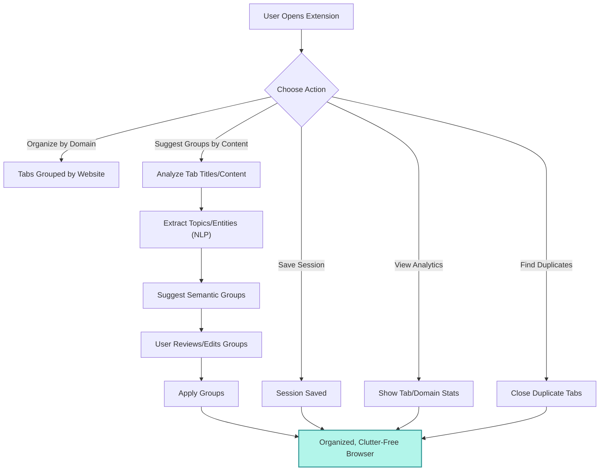

# Smart Tab Organiser: Architecture Overview

Below is an interactive flowchart showing the main user flow and features of the extension, including content-based grouping, session management, analytics, and duplicate detection:

# Architecture Overview: Smart Tab Organiser

This document provides a technical overview of the Smart Tab Organiser Chrome Extension.

## 1. Core Components

The extension is built on Manifest V3 and is composed of the following main components:

- **`manifest.json`**: The entry point of the extension. It defines permissions (`tabs`, `windows`, `tabGroups`, `storage`, `offscreen`), the background service worker, the popup UI, and the options page.
- **`background.js` (Service Worker)**: This is the brain of the extension. It runs in the background and handles all core logic.
  - **Message Listener (`chrome.runtime.onMessage`)**: A central router that listens for commands from the popup UI.
  - **Core Logic**: Contains functions for analyzing, grouping, and managing tabs. It uses the `chrome.tabs` and `chrome.tabGroups` APIs for all organization tasks.
  - **`groupTabsInChunks(tabs, domain)`**: A reusable function that takes a list of tabs and a domain name. It chunks the tabs into groups and creates a new browser window to contain each group. The chunk size is dynamic, defaulting to 25 tabs, 50 for large sessions (>250 tabs), or a user-defined value from the settings page.
  - **`organizeTabsForDomain(domain)`**: The function backing the per-domain "Organize" button. It finds all ungrouped tabs for a given domain across all windows, and if they exceed a threshold (5), it passes them to `groupTabsInChunks`.
  - **`organizeTabsByDomain()`**: The function for the "Organize All" button. It first ungroups all existing tabs, then groups tabs by domain if they exceed a certain threshold (e.g., >5 tabs). Any remaining "scattered" tabs are returned to the UI, where the user is prompted to either group them or leave them as is.
  - **`groupSpecificTabs(tabIds)`**: A helper function called from the UI to group a specific list of scattered tabs after the user confirms the action.
  - **State Management**: Manages settings (including the custom chunk size) and the undo/redo stacks in memory, with persistence to `chrome.storage.local`.
  - **`getComprehensiveStats()`**: Calculates a wide range of statistics, including total tabs, windows, groups, audible tabs, and duplicates.
  - **`copyUrlsByDomain(domain)`**: Copies all URLs from a given domain to the clipboard. This requires creating a temporary offscreen document (`offscreen.html`) to access the `navigator.clipboard` API, as direct access is not allowed from service workers.
  - **`saveTabsForLater(domain)`**: Closes all tabs from a specified domain and saves their URLs as a group to `chrome.storage.local`.
  - **`getSavedGroups()`**: Retrieves all saved tab groups from storage.
  - **`restoreSavedGroup(timestamp)`**: Restores a saved group, opening its URLs in a new window and then deleting the group from storage.
  - **`deleteSavedGroup(timestamp)`**: Permanently deletes a saved group from storage.

The script also manages undo/redo stacks (`undoStack`, `redoStack`) in `chrome.storage.local` to allow users to revert or reapply organizational changes.

- **`popup.html` / `popup.js`**: This is the main user interface.
  - **UI (`popup.html`)**: Defines the structure of the popup, which is organized into two main tabs: "Analyzer" and "Saved". It contains the statistics dashboard, action buttons, and domain analysis lists. It references local copies of `Chart.js` and `Shepherd.js` from a local `lib/` folder to comply with security policies.
  - **Logic (`popup.js`)**: Manages the tab-switching logic between the "Analyzer" and "Saved" views. It sends messages to the background script to trigger actions and receives data back to render the UI for the active view. It also contains the logic for the Shepherd.js interactive tour.
- **`options.html` / `options.js`**: Provides a settings page for users to manage saved sessions and configure extension settings.
- **`lib/`**: A directory containing local copies of third-party libraries like `Chart.js` and `Shepherd.js` to avoid external script loading.

## 2. Key Feature Workflows

- **Tab Organization (Per-Domain and All)**:
  1.  The user clicks either "Organize" for a domain or the "Organize All Tabs" button.
  2.  A message is sent to `background.js` (`organizeByDomain` or `organizeAll`).
  3.  `organizeTabsByDomain` first ungroups all tabs. It then analyzes tabs by domain and groups any with more than 5 tabs.
  4.  Any remaining (scattered) tabs are returned to `popup.js`. The user is shown a confirmation prompt asking if they want to group these remaining tabs.
  5.  If the user confirms, a `groupScatteredTabs` message is sent, and the tabs are passed to `groupTabsInChunks`.
  6.  `groupTabsInChunks` creates new windows for each chunk, using the user's custom chunk size or the dynamic default.
- **Statistics Dashboard**: On popup open, `popup.js` sends `getComprehensiveStats` to the background. `background.js` calculates stats (totals, duplicates, audible, etc.) and returns a data object. `popup.js` then renders this data in the UI grid and the Chart.js pie chart.
- **Interactive Stats**: Clicking the "Audible Tabs" stat sends `focusAudibleTab`. The background script finds the relevant tab and uses `chrome.windows.update` and `chrome.tabs.update` to bring it into focus.
- **Proactive Suggestions**: On popup open, `popup.js` sends `getGroupingSuggestions`. The background script analyzes ungrouped tabs and returns any domains with >5 tabs. The popup then renders these as actionable suggestions.
- **Undo/Redo**: When an action is performed, its details are pushed to an `undoStack`. When "Undo" is clicked, the action is reversed, and the state is pushed to a `redoStack`. This allows for a non-destructive undo/redo flow.

## 3. Development & Deployment Process

The project is configured for a professional development workflow.

- **Dependency Management**: `package.json` manages development dependencies like ESLint and Terser.
- **Code Quality**: ESLint (`.eslintrc.json`) is used to enforce a consistent code style. It can be run with `npm run lint`.
- **Build Process**: A build step, run with `npm run build`, uses `Terser` to minify all JavaScript files for production, outputting them to a `/build` directory.
- **Deployment**: The `create-deployment-package.ps1` script fully automates the creation of a production-ready package. It runs the linter, runs the build, and copies only the necessary, minified assets and the `lib/` folder into a final `/dist` folder.
- **Exclusion**: The `.deployignore` file ensures that no source code, documentation, or development files are included in the final `/dist` package.
- **Documentation**: All project documentation, including this file, a User Guide, a PRD, and a Testing Plan, is located in the `/docs` folder.

## 4. Data Storage

- **`chrome.storage.local`**: Used for storing session-specific data that should not sync across devices.
  - `undoStack`: An array of previous states to enable undo functionality.
  - `redoStack`: An array of undone states to enable redo functionality.
  - `savedGroups`: An array of objects, where each object represents a group of saved tabs.
- **`chrome.storage.sync`**: Used for storing user-configurable settings that should sync across devices.
  - `suggestionThreshold`: The number of tabs from a single domain required to trigger a grouping suggestion.
- **`chrome.storage.session`**: Used for temporary, in-memory storage for the lifespan of a browser session. It is not currently used but is available for features requiring non-persistent session data.
- **Dark Mode Preference**: The user's dark/light mode preference is stored in `localStorage` to ensure it is applied instantly on popup load.

## 5. Build & Deployment

The project includes a streamlined build and deployment process automated via a PowerShell script (`create-deployment-package.ps1`).

1.  **Linting**: `eslint .` is run to catch any code quality issues.
2.  **Minification**: `terser` is used to minify all core JavaScript files (`background.js`, `popup.js`, `options.js`) into a `build/` directory.
3.  **Packaging**: The script creates a clean `dist/` directory, copies the minified JS from `build/`, the third-party libraries from `lib/`, and adds all other necessary assets (`manifest.json`, HTML files, icons), excluding all development files.

This process ensures the final uploaded package is small, optimized, and contains only production-ready code.
